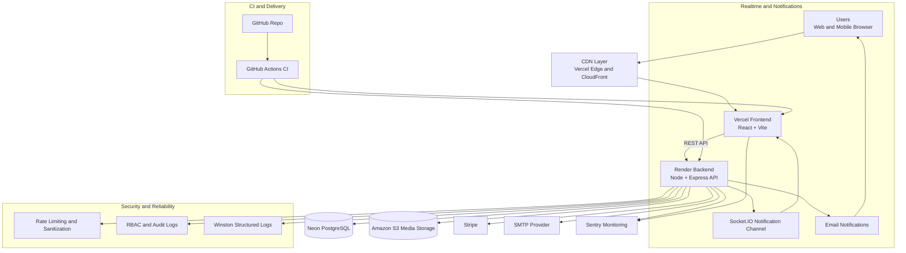

# EpixBox Infrastructure Diagram

```mermaid
graph TD
  U[Users\nWeb and Mobile Browser] --> CF[CDN Layer\nVercel Edge and CloudFront]
  CF --> FE[Vercel Frontend\nReact + Vite]
  FE -->|REST API| BE[Render Backend\nNode + Express API]
  BE --> DB[(Neon PostgreSQL)]
  BE --> S3[(Amazon S3 Media Storage)]
  BE --> ST[Stripe]
  BE --> SMTP[SMTP Provider]
  BE --> SEN[Sentry Monitoring]
  FE --> SEN

  subgraph Realtime and Notifications
    BE --> WS[Socket.IO Notification Channel]
    WS --> FE
    BE --> EMAIL[Email Notifications]
    EMAIL --> U
  end

  subgraph Security and Reliability
    BE --> RL[Rate Limiting and Sanitization]
    BE --> RBAC[RBAC and Audit Logs]
    BE --> LOG[Winston Structured Logs]
  end

  subgraph CI and Delivery
    GH[GitHub Repo] --> CI[GitHub Actions CI]
    CI --> FE
    CI --> BE
  end
```

# Notes

- Versioned API base path: `/api/v1`
- Swagger docs: `/api/docs` and `/api/v1/docs`
- API analytics: `/api/admin/rate-analytics`
