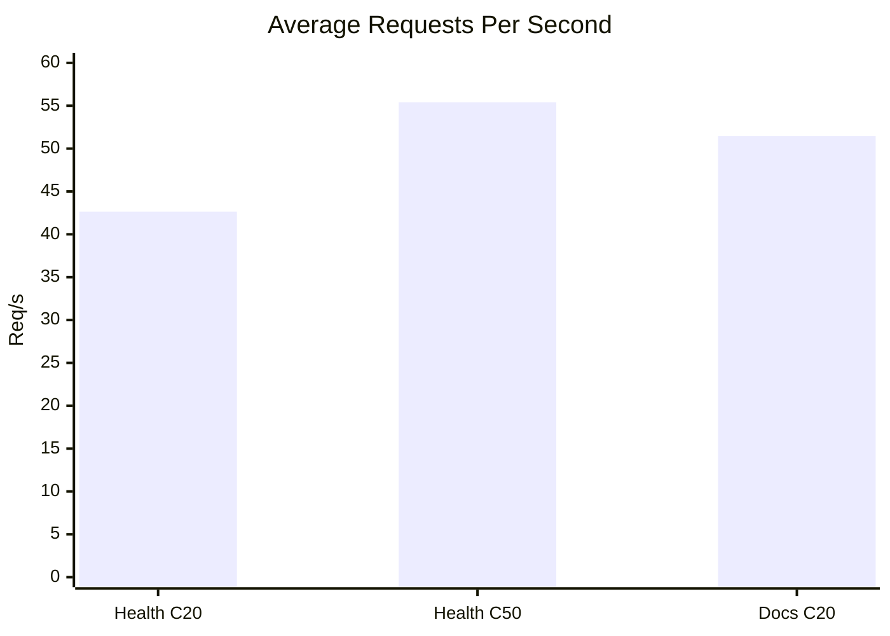
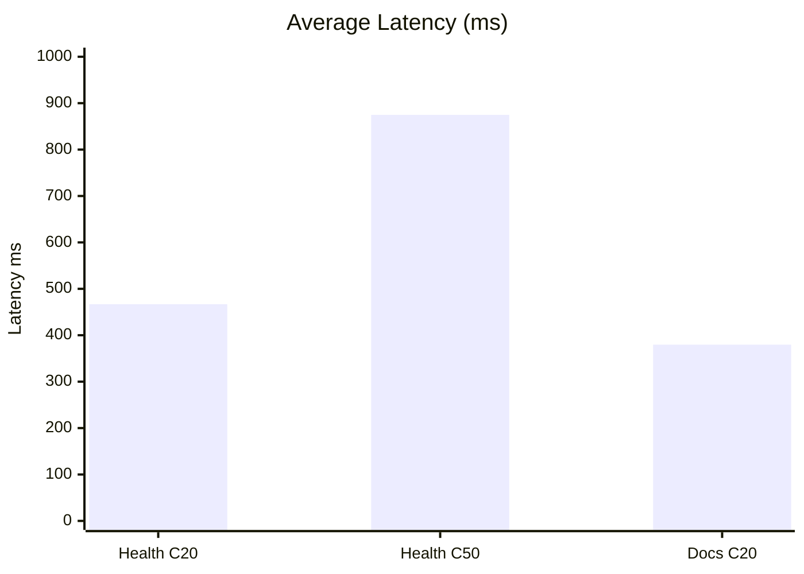

# Load Test Result Graphs

Load tests were executed with `autocannon` against production endpoints.

# Raw Results

| Scenario | Connections | Duration | Avg Req/s | Avg Latency (ms) | P99 (ms) | Errors | Timeouts |
|---|---:|---:|---:|---:|---:|---:|---:|
| Health endpoint | 20 | 20s | 42.65 | 466.83 | 1311 | 0 | 0 |
| Health endpoint | 50 | 20s | 55.40 | 874.77 | 1930 | 0 | 0 |
| Docs endpoint | 20 | 20s | 51.45 | 379.67 | 949 | 0 | 0 |

# Throughput Graph

# Latency Graph

# Interpretation

- The service remained stable under all tested loads with zero request errors.
- Throughput increases at higher concurrency, with expected latency growth.
- Static docs endpoint performed better than health endpoint under tested conditions due to warm cache behavior.
